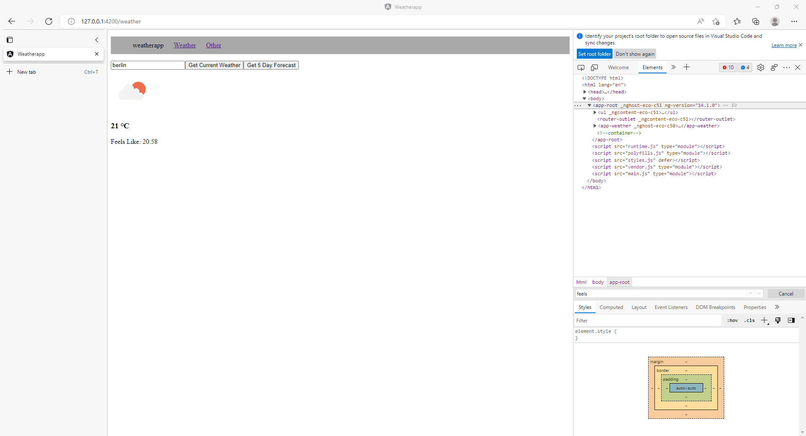

</img>

# Simple weather app

Simple <i>Angular</i> app created to gain better understanding of Angular and TypeScript during my internship @ <a href="https://www.rt-rk.com/">RT-RK</a>.  
Application conects to <a href="https://openweathermap.org/api">OpenWeatherMap API</a> and retrieves weather data about the entered city which is then displayed using html heading and paragraph.

## Screenshots

## To-Do List
- [ ] Implement <u>Five Day Forecast</u> functionality.